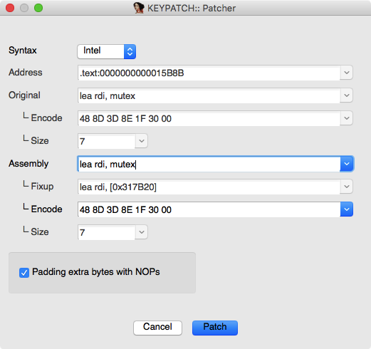
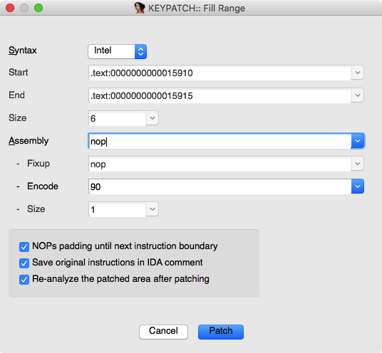
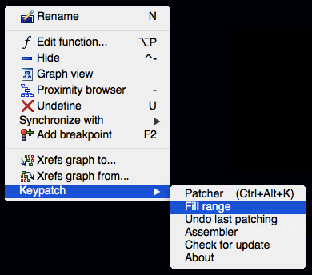
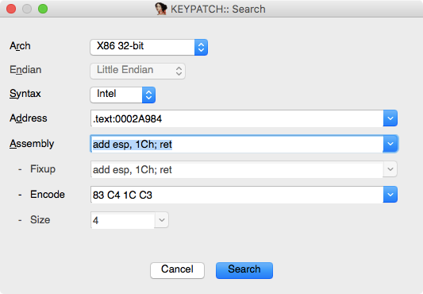
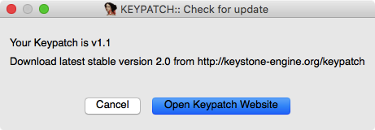

Keypatch Tutorial
=================

This is a quick tutorial for new users of [Keypatch](http://keystone-engine.org/keypatch).
You are supposed to already have Keypatch installed for your IDA Pro.

See [README.md](README.md) for a complete guideline of Keypatch.

### 1. Use **Patcher** tool

- Load a binary into IDA.
- At any place in IDA window, press the hotkey `Ctrl-Alt-K` to open the
  Patcher dialog.
- Enter a new assembly instruction to the Assembly control.
- Click button `Patch` to change the original instruction to the new instruction.

### 2. Use **Fill Range** tool

- Load a binary into IDA.
- Select a range of code in IDA window, then press the hotkey `Ctrl-Alt-K` to open
  the "Fill Range" dialog. Note that the same hotkey would open the Patcher window
  if you do not select a range of code, as in tutorial 1 above.
- Enter a new assembly instruction to the Assembly control. Alternatively, you can
  also enter a string in hexcode format, such as "0x90", "90, 91", "AAh", etc.
- Click button `Patch` to fill the selected range with the input above.

### 3. Revert (undo) the last patching

- After any modification (like in tutorial 2 or 3 above), do right-click in
  IDA window, then choose from the popup menu `Keypatch | Undo last patching`
  to revert (undo) the last action.

### 4. Save the modification

- After all the patching done in tutorial 1, 2, 3 above, save all the modifications
  by choosing menu `Edit | Patch program | Apply patches to input file`. Note that
  this really changes the original binary, so be sure this is what you desire.

### 5. Use **Search** tool

- Open the Search dialog by either right-click in IDA window, then choose from
  the popup menu `Keypatch | Search`. Or choose from the main menu `Edit | Keypatch | Search`.
- Enter assembly instructions in the Assembly control, then click "Search" to search
  for these instructions in code section. Keypatch would show the result in a new window.
  in which you can double-click each address to jump to the related code.

  Note that it is possible to enter more than one assembly instruction, and separating
  them by semi-colons signs (ie `;`).

### 6. Check for new update of Keypatch

- Right-click in IDA window, then choose from the popup menu `Keypatch | Check for update`.
  A new window will show up, in which the current version & latest stable version
  (released by Keypatch developers) are reported.
- Click button "Open Keypatch Website" if you want to visit the Keypatch
  homepage to download the latest version.

### 7. Verify the current versions of Keypatch & Keystone engine

- Right-click in IDA window, then choose from the popup menu `Keypatch | About`.
